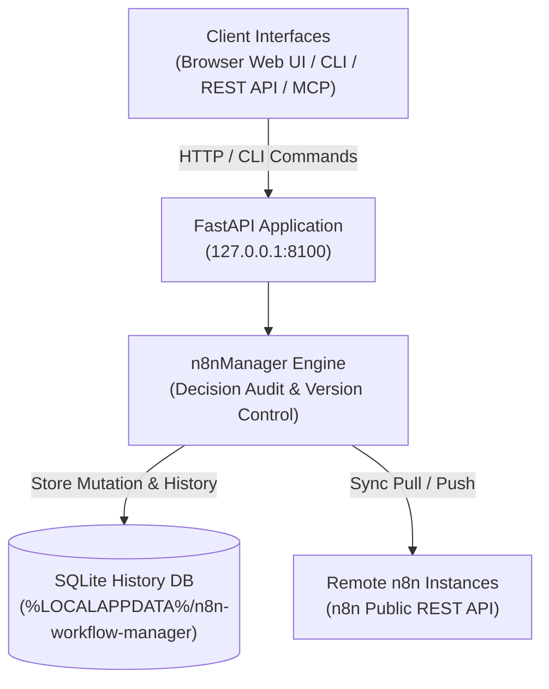
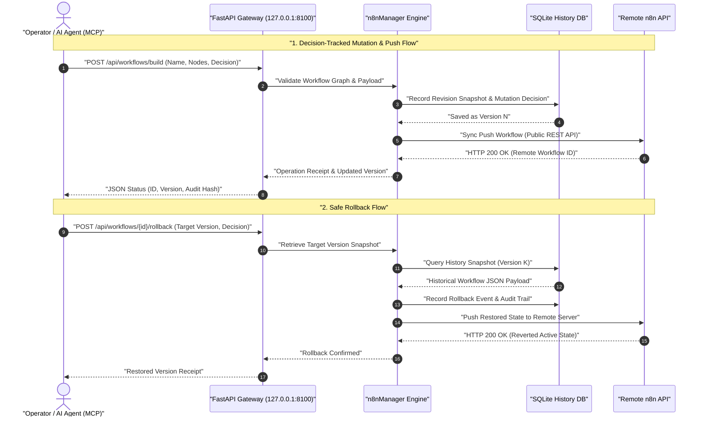

# n8n Workflow Manager

**[Deutsche Version](README_de.md)** · **English**

> Local-first workflow review, visual inspection, decision-tracked editing, history, and multi-server sync for n8n.

> [!IMPORTANT]
> Independent community project. Not affiliated with, endorsed by, or sponsored
> by n8n GmbH. "n8n" is a trademark of its respective owner and is used here only
> to describe the software this tool interoperates with.

[](https://www.python.org/downloads/)
[](pyproject.toml)
[](LICENSE)
[](tests)
[](https://fastapi.tiangolo.com/)
[](https://github.com/astral-sh/ruff)
[](#what-it-does)
[](SECURITY.md)
[](SECURITY.md)
[](https://github.com/ellmos-ai)
[](https://github.com/open-bricks)
[](llms.txt)

> [!NOTE]
> **AI Agent & LLM Context**: Machine-readable specification and RAG search phrases are indexed in [`llms.txt`](llms.txt). Pairs with [`n8n-manager-mcp`](https://github.com/ellmos-ai/n8n-manager-mcp) for autonomous AI workflow operations with decision tracking. All mutation operations require an explicit `--decision` or `decision` payload parameter to maintain auditability.

## Navigation

- [System Architecture](#system-architecture)
- [Workflow Lifecycle](#workflow-lifecycle)
- [Governance & Runtime Invariants](#governance-and-runtime-invariants)
- [What it does](#what-it-does)
- [Install and start](#install-and-start)
- [CLI examples](#cli-examples)
- [Builder API](#builder-api)
- [Configuration and data](#configuration-and-data)
- [Docker](#docker)
- [Remote n8n setup](#remote-n8n-setup)
- [Manager + MCP pairing](#manager-plus-mcp-pairing)
- [Sibling Ecosystem](#sibling-ecosystem)
- [Verification](#verification)
- [License](#license)

---

<a id="system-architecture"></a>
## System Architecture



---

<a id="workflow-lifecycle"></a>
## Workflow Lifecycle

The following sequence demonstrates how operations (such as building or mutating a workflow) require an explicit audit decision, persist immutable snapshots into SQLite, sync to remote n8n servers, and enable deterministic rollback.



---

<a id="governance-and-runtime-invariants"></a>
## Governance & Runtime Invariants

| # | Invariant | Description | Enforcement Mechanism |
|---|---|---|---|
| 1 | **100% Local-First & Zero Egress** | Runs entirely on loopback `127.0.0.1` with no external analytics or phone-home tracking. | FastAPI host binding & test suite |
| 2 | **Mandatory Decision Audit** | Every modifying mutation (`import`, `build`, `push`, `rollback`, `delete`) requires an explicit decision rationale. | CLI `--decision` check & REST validation |
| 3 | **SQLite Event & Snapshot Ledger** | Full workflow JSON snapshots are versioned immutably in SQLite. | `n8nManager.core.database` schema |
| 4 | **Deterministic Rollback Safety** | Any previous workflow version can be inspected and restored without data loss. | `/api/workflows/{id}/rollback` & CLI `rollback` |
| 5 | **Non-Elevation (RunAsInvoker)** | Never requires administrative or root privileges. | User-space execution & unprivileged Docker user |
| 6 | **Cross-Platform Path Parity** | Respects native configuration and data directories across Windows, macOS, and Linux. | Platformdirs resolution |
| 7 | **API Key Redaction & Hygiene** | Sensitive n8n API tokens are redacted from UI/REST responses and stored only in local user data. | Serialization masking |
| 8 | **Vendored Offline Assets** | Frontend dependencies (vis-network 10.1.0) are pinned and bundled for complete offline operation. | Static vendored assets with SRI hashes |
| 9 | **Agent & MCP Interoperability** | Seamless pairing with `n8n-manager-mcp` for autonomous AI workflow manipulation with human auditability. | Standard JSON REST contracts & `llms.txt` |
| 10 | **48-Hour Security SLA** | Coordinated vulnerability disclosure and rapid patching across ellmos-ai & open-bricks. | [SECURITY.md](SECURITY.md) policy commitment |

---

<a id="what-it-does"></a>
## What it does

- Visual graph viewer and working browser editor for n8n workflow JSON.
- SQLite-backed version history and decision audit for every mutation.
- Rollback through the REST API or CLI.
- Per-workflow/per-server pull/push bindings using the n8n public API and cursor pagination.
- JSON and Markdown export, validated imports, and bundled generic templates.
- FastAPI REST API, Swagger UI, and a terminal CLI.

The application is local-first: it binds to `127.0.0.1` by default and stores
configuration and runtime data in per-user directories rather than inside the
installed package or source checkout.

---

<a id="install-and-start"></a>
## Install and start

```bash
pip install git+https://github.com/ellmos-ai/n8n-workflow-manager.git
n8n-manager serve
```

Open <http://127.0.0.1:8100>. Interactive API documentation is at
<http://127.0.0.1:8100/docs>.

For development:

```bash
git clone https://github.com/ellmos-ai/n8n-workflow-manager.git
cd n8n-workflow-manager
python -m pip install -e ".[dev]"
python -m pytest -q
```

---

<a id="cli-examples"></a>
## CLI examples

> [!WARNING]
> `push`, `rollback` and `delete` change or remove workflows **on the connected
> n8n server**, not just in the local database. Point them at a production
> instance only when you know which server is the default (`n8n-manager status`).
> API keys you register with `servers --add` are stored **unencrypted** in the
> per-user data directory; protect that directory the same way you would protect
> an SSH key. See [SECURITY.md](SECURITY.md).

Mutations that can replace or remove state require a short decision. It is
stored with workflow history.

```bash
n8n-manager import workflow.json --decision "Import reviewed customer workflow"
n8n-manager list
n8n-manager history 1
n8n-manager export 1 --format md

n8n-manager servers --add production https://n8n.example.com YOUR_API_KEY --default
n8n-manager push 1 --decision "Deploy reviewed version"
n8n-manager pull
n8n-manager rollback 1 2 --decision "Restore last known-good version"

n8n-manager status                       # effective paths, database and server state
n8n-manager config --show                # inspect the resolved configuration
n8n-manager config --set db_path ./my.db # change a single setting
```

TLS verification is on by default. `--no-verify-tls` exists for controlled
local environments with self-signed certificates; do not use it across
untrusted networks.

---

<a id="builder-api"></a>
## Builder API

```bash
curl -X POST http://127.0.0.1:8100/api/workflows/build \
  -H "Content-Type: application/json" \
  -d '{
    "name": "Webhook forwarder",
    "decision": "Create a reviewed draft",
    "nodes": [
      {"type": "n8n-nodes-base.webhook", "name": "Trigger", "parameters": {"path": "hook"}},
      {"type": "n8n-nodes-base.httpRequest", "name": "Forward", "parameters": {"url": "https://api.example.com"}}
    ],
    "connections": [{"from_node": "Trigger", "to_node": "Forward"}]
  }'
```

See [API_REFERENCE.md](docs/API_REFERENCE.md) for the mutation and history
contracts.

---

<a id="configuration-and-data"></a>
## Configuration and data

`n8n-manager status` prints the effective paths. Relative `db_path` values are
resolved below the user data directory.

| Platform | Configuration | Runtime data |
|---|---|---|
| Windows | `%APPDATA%\n8n-workflow-manager` | `%LOCALAPPDATA%\n8n-workflow-manager` |
| macOS | `~/Library/Application Support/n8n-workflow-manager` | same directory |
| Linux | `${XDG_CONFIG_HOME:-~/.config}/n8n-workflow-manager` | `${XDG_DATA_HOME:-~/.local/share}/n8n-workflow-manager` |

Overrides: `N8N_MANAGER_CONFIG`, `N8N_MANAGER_CONFIG_DIR`, and
`N8N_MANAGER_DATA_DIR`. Start with [config.example.json](config.example.json).
The default `trusted_hosts` accepts only loopback Host headers; explicitly list
the reviewed public hostname when using an authenticated reverse proxy.

---

<a id="docker"></a>
## Docker

```bash
docker compose up --build -d
```

The Compose port is bound to `127.0.0.1:8100`, and state is mounted below
`runtime/`. The image runs as an unprivileged user.

---

<a id="remote-n8n-setup"></a>
## Remote n8n setup

The setup command expects Docker to have been installed according to the remote
host's operating-system policy. It installs a pinned official n8n image on a
loopback-only port; it does not run a remote `curl | sh` installer.

```bash
n8n-manager setup --host your-server --user deploy --ssh-key ~/.ssh/id_ed25519
# Follow the printed ssh -L ... tunnel command, then open http://127.0.0.1:5678
```

SSH uses batch mode and `StrictHostKeyChecking=accept-new`. For public service,
provide an authenticated TLS reverse proxy. Do not expose either n8nManager or
the generated n8n listener directly to the internet.

---

<a id="manager-plus-mcp-pairing"></a>
## Manager + MCP pairing

`n8n-workflow-manager` and
[n8n-manager-mcp](https://github.com/ellmos-ai/n8n-manager-mcp) are designed as
a pair: the MCP server is the AI action layer, while this project is the human
state-and-history layer with visual review, per-workflow decisions, versions,
and rollback. A client can read `/api/workflows/{id}/history` before submitting
the required decision for a mutation.

The authoritative decision log lives here and is client-independent, so the
same review trail can cover the MCP server, `curl`, the CLI, or the web UI.

If you are running n8n as part of a self-hosted stack rather than standalone,
[ellmos-stack](https://github.com/ellmos-ai/ellmos-stack) brings up n8n together
with Ollama and a document index via Docker Compose; this manager then connects
to that instance like to any other n8n server.
Conversational context can additionally come from a pull-based history index
such as [ctx](https://github.com/ctxrs/ctx) (Apache-2.0).

---

<a id="sibling-ecosystem"></a>
## Sibling Ecosystem

`n8n-workflow-manager` is an integral component of the [ellmos-ai](https://github.com/ellmos-ai) and [open-bricks](https://github.com/open-bricks) open-source ecosystems:

| Repository | Purpose | Integration |
|---|---|---|
| [`ellmos-ai/n8n-manager-mcp`](https://github.com/ellmos-ai/n8n-manager-mcp) | MCP Server for n8n workflow management | Autonomous AI agent action layer with decision audit |
| [`ellmos-ai/ellmos-stack`](https://github.com/ellmos-ai/ellmos-stack) | All-in-one local AI & automation stack | Runs n8n, Ollama, and Chroma via Docker Compose |
| [`ellmos-ai/ellmos-homebase-mcp`](https://github.com/ellmos-ai/ellmos-homebase-mcp) | Central knowledge base & memory MCP | Cross-session agent memory and coordination |
| [`ellmos-ai/ellmos-controlcenter-mcp`](https://github.com/ellmos-ai/ellmos-controlcenter-mcp) | Multi-agent registry and tool orchestration | Dynamic tool bundling and routing |
| [`open-bricks/open-bricks`](https://github.com/open-bricks) | Umbrella open-source organization | Shared standards, security guidelines, and governance |

---

<a id="verification"></a>
## Verification

The release contract is documented in [RELEASE_GATE.md](RELEASE_GATE.md). The
core local gates are:

```bash
python -m pytest -q
python -m ruff check n8nManager tests
python -m bandit -q -r n8nManager -lll
python -m pip_audit
python -m build
```

---

<a id="license"></a>
## License

MIT; see [LICENSE](LICENSE). Use at your own risk; no warranty or maintenance
commitment is provided.

That license covers the code written for this project. The repository and the
built distributions also ship the browser library **vis-network** (dual licensed
Apache-2.0 or MIT; used here under the MIT option), which keeps its own
copyright holders. Full notices: [THIRD_PARTY_LICENSES.md](THIRD_PARTY_LICENSES.md).
