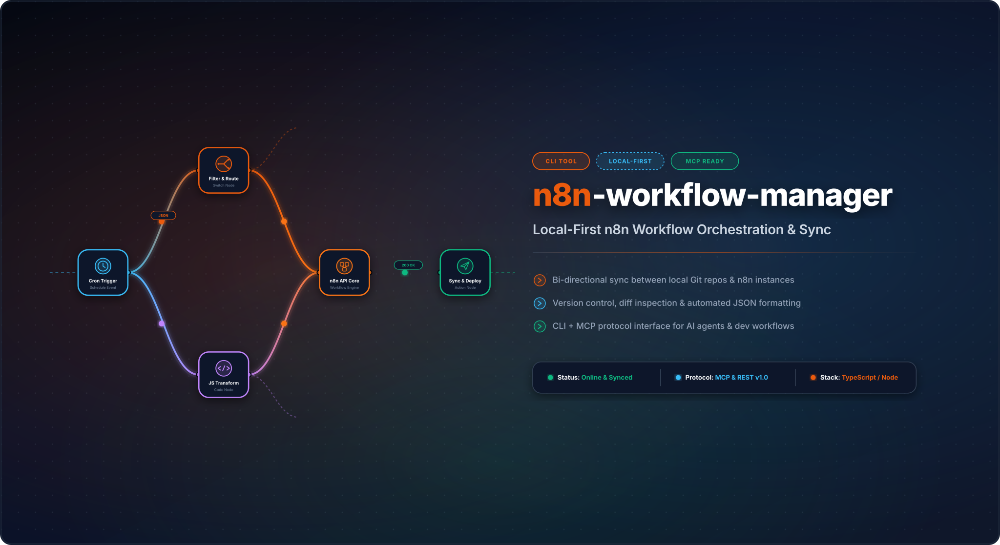

# n8n Workflow Manager

**[Deutsche Version](README_de.md)** · **English**

> Local-first workflow review, editing, history, and multi-server sync for n8n.

[](https://www.python.org/downloads/)
[](LICENSE)

## What it does

- Visual graph viewer and working browser editor for n8n workflow JSON.
- SQLite-backed version history and decision audit for every mutation.
- Rollback through the REST API or CLI.
- Per-workflow/per-server pull/push bindings using the n8n public API and cursor pagination.
- JSON and Markdown export, validated imports, and bundled generic templates.
- FastAPI REST API, Swagger UI, and a terminal CLI.

The application is local-first: it binds to `127.0.0.1` by default and stores
configuration and runtime data in per-user directories rather than inside the
installed package or source checkout.

## Install and start

```bash
pip install git+https://github.com/ellmos-ai/n8n-workflow-manager.git
n8n-manager serve
```

Open <http://127.0.0.1:8100>. Interactive API documentation is at
<http://127.0.0.1:8100/docs>.

For development:

```bash
git clone https://github.com/ellmos-ai/n8n-workflow-manager.git
cd n8n-workflow-manager
python -m pip install -e ".[dev]"
python -m pytest -q
```

## CLI examples

Mutations that can replace or remove state require a short decision. It is
stored with workflow history.

```bash
n8n-manager import workflow.json --decision "Import reviewed customer workflow"
n8n-manager list
n8n-manager history 1
n8n-manager export 1 --format md

n8n-manager servers --add production https://n8n.example.com YOUR_API_KEY --default
n8n-manager push 1 --decision "Deploy reviewed version"
n8n-manager pull
n8n-manager rollback 1 2 --decision "Restore last known-good version"
```

TLS verification is on by default. `--no-verify-tls` exists for controlled
local environments with self-signed certificates; do not use it across
untrusted networks.

## Builder API

```bash
curl -X POST http://127.0.0.1:8100/api/workflows/build \
  -H "Content-Type: application/json" \
  -d '{
    "name": "Webhook forwarder",
    "decision": "Create a reviewed draft",
    "nodes": [
      {"type": "n8n-nodes-base.webhook", "name": "Trigger", "parameters": {"path": "hook"}},
      {"type": "n8n-nodes-base.httpRequest", "name": "Forward", "parameters": {"url": "https://api.example.com"}}
    ],
    "connections": [{"from_node": "Trigger", "to_node": "Forward"}]
  }'
```

See [API_REFERENCE.md](docs/API_REFERENCE.md) for the mutation and history
contracts.

## Configuration and data

`n8n-manager status` prints the effective paths. Relative `db_path` values are
resolved below the user data directory.

| Platform | Configuration | Runtime data |
|---|---|---|
| Windows | `%APPDATA%\n8n-workflow-manager` | `%LOCALAPPDATA%\n8n-workflow-manager` |
| macOS | `~/Library/Application Support/n8n-workflow-manager` | same directory |
| Linux | `${XDG_CONFIG_HOME:-~/.config}/n8n-workflow-manager` | `${XDG_DATA_HOME:-~/.local/share}/n8n-workflow-manager` |

Overrides: `N8N_MANAGER_CONFIG`, `N8N_MANAGER_CONFIG_DIR`, and
`N8N_MANAGER_DATA_DIR`. Start with [config.example.json](config.example.json).
The default `trusted_hosts` accepts only loopback Host headers; explicitly list
the reviewed public hostname when using an authenticated reverse proxy.

## Docker

```bash
docker compose up --build -d
```

The Compose port is bound to `127.0.0.1:8100`, and state is mounted below
`runtime/`. The image runs as an unprivileged user.

## Remote n8n setup

The setup command expects Docker to have been installed according to the remote
host's operating-system policy. It installs a pinned official n8n image on a
loopback-only port; it does not run a remote `curl | sh` installer.

```bash
n8n-manager setup --host your-server --user deploy --ssh-key ~/.ssh/id_ed25519
# Follow the printed ssh -L ... tunnel command, then open http://127.0.0.1:5678
```

SSH uses batch mode and `StrictHostKeyChecking=accept-new`. For public service,
provide an authenticated TLS reverse proxy. Do not expose either n8nManager or
the generated n8n listener directly to the internet.

## Manager + MCP pairing

`n8n-workflow-manager` and
[n8n-manager-mcp](https://github.com/ellmos-ai/n8n-manager-mcp) are designed as
a pair: the MCP server is the AI action layer, while this project is the human
state-and-history layer with visual review, per-workflow decisions, versions,
and rollback. A client can read `/api/workflows/{id}/history` before submitting
the required decision for a mutation.

The authoritative decision log lives here and is client-independent, so the
same review trail can cover the MCP server, `curl`, the CLI, or the web UI.
Conversational context can additionally come from a pull-based history index
such as [ctx](https://github.com/ctxrs/ctx) (Apache-2.0).

## Verification

The release contract is documented in [RELEASE_GATE.md](RELEASE_GATE.md). The
core local gates are:

```bash
python -m pytest -q
python -m ruff check n8nManager tests
python -m bandit -q -r n8nManager -lll
python -m pip_audit
python -m build
```

## License

MIT; see [LICENSE](LICENSE). Use at your own risk; no warranty or maintenance
commitment is provided.
