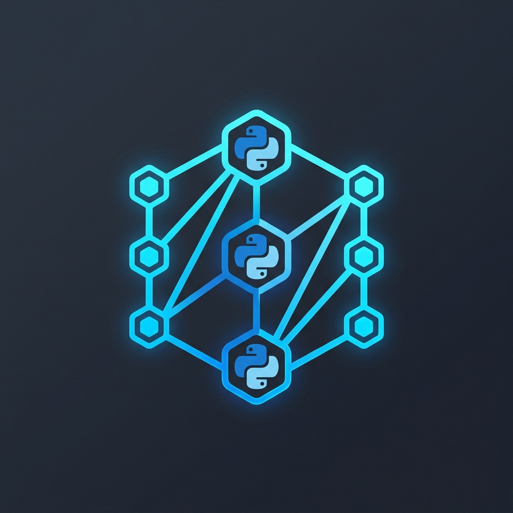
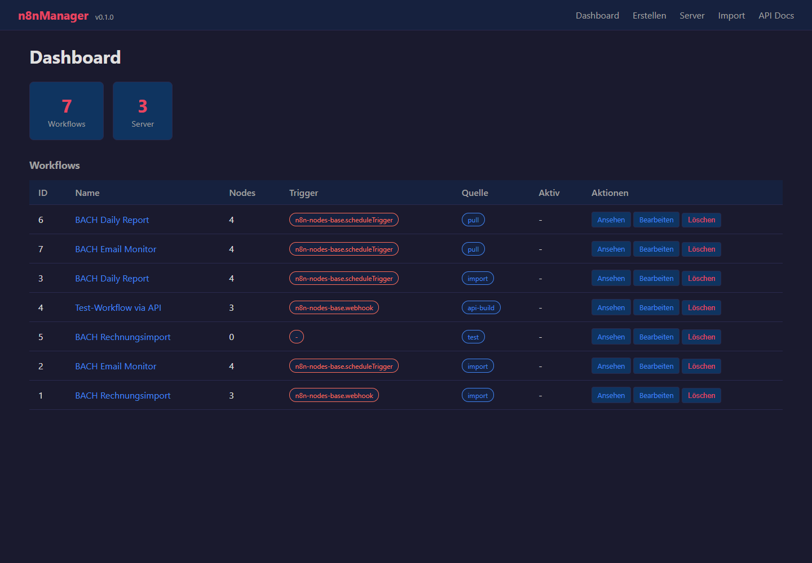
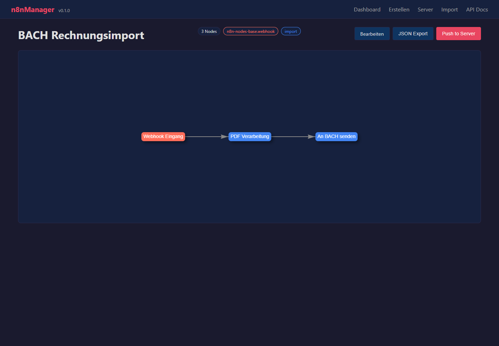

# n8n Workflow Manager

**🇬🇧 [English Version](README.md)**

*Teil der [ellmos-ai](https://github.com/ellmos-ai) Familie.*

[](https://www.python.org/downloads/)
[](https://opensource.org/licenses/MIT)
[](https://fastapi.tiangolo.com/)

**Ein lokaler n8n Workflow Manager mit visuellem Graph-Viewer, REST API, CLI und Multi-Server-Sync in einem Python-Paket.**

> Verwalte, visualisiere, dokumentiere und synchronisiere n8n Workflows über mehrere Server von einem einzigen Dashboard aus.

## Screenshots





## Einstieg

| Ziel | Einstieg |
|---|---|
| lokale n8n Workflow-Exporte prüfen | Dashboard und visueller Workflow-Viewer |
| Workflows für Übergabe oder Review dokumentieren | Markdown-Export und API-Dokumentation |
| Workflows zwischen mehreren n8n Servern synchronisieren | Server-Verwaltung, Pull- und Push-Befehle |
| Agenten Workflow-Entwürfe erzeugen lassen | `/api/workflows/build` Endpoint |
| n8n auf einem entfernten Docker-Host installieren | `n8n-manager setup` |

## Funktionen

- **Visueller Workflow-Viewer** -- Interaktive Graph-Visualisierung mit vis.js. Zoomen, Schwenken, Knoten anklicken für Details.
- **Web-Dashboard** -- Übersicht aller Workflows mit Status, Tags und Schnellaktionen.
- **Workflow-Editor** -- Knoten hinzufügen, verbinden und konfigurieren im Browser per Drag-and-Drop.
- **Multi-Server-Verwaltung** -- Verbindung zu mehreren n8n-Instanzen. Workflows zwischen ihnen pushen/pullen.
- **REST API + Swagger** -- Vollständige CRUD-API mit automatisch generierter Dokumentation unter `/docs`.
- **CLI** -- Workflows vom Terminal aus verwalten: Import, Export, Push, Pull, Auflisten und mehr.
- **Duplikaterkennung** -- Content-Hash-basierte Deduplizierung verhindert doppelten Import desselben Workflows.
- **Versionshistorie** -- Änderungen an Workflows über die Zeit verfolgen mit automatischer Versionierung.
- **Workflow Builder API** -- Workflows programmatisch per POST-Request erstellen (ideal für KI-Agenten).
- **Remote n8n Setup** -- n8n auf entfernten Servern via SSH + Docker mit einem einzigen Befehl installieren.
- **JSON + Markdown Export** -- Workflows als sauberes JSON oder als menschenlesbare Markdown-Dokumentation exportieren.
- **Workflow-Vorlagen** -- Vorgefertigte Vorlagen für gängige Automatisierungsmuster.

## Schnellstart

### Installation

```bash
pip install n8n-workflow-manager
```

Oder aus dem Quellcode:

```bash
git clone https://github.com/ellmos-ai/n8n-workflow-manager.git
cd n8n-workflow-manager
pip install -e .
```

### Verwendung

```bash
# Web-UI + API-Server starten
n8n-manager serve

# Im Browser öffnen: http://localhost:8100
# Swagger API-Dokumentation: http://localhost:8100/docs
```

### CLI-Beispiele

```bash
# Workflow aus JSON-Datei importieren
n8n-manager import my-workflow.json

# Alle Workflows auflisten
n8n-manager list

# Als Markdown-Dokumentation exportieren
n8n-manager export 1 --format md

# Einen n8n-Server hinzufügen
n8n-manager servers --add production https://n8n.example.com:5678 YOUR_API_KEY --default

# Workflow auf Server pushen
n8n-manager push 1

# Alle Workflows vom Server pullen
n8n-manager pull

# Systemstatus prüfen
n8n-manager status

# n8n auf einem Remote-Server installieren
n8n-manager setup --host 1.2.3.4 --ssh-key ~/.ssh/id_ed25519
```

### Docker

```bash
docker-compose up -d
# Öffne http://localhost:8100
```

## API für KI-Agenten

Der `/api/workflows/build` Endpoint ermöglicht die programmatische Workflow-Erstellung:

```bash
curl -X POST http://localhost:8100/api/workflows/build \
  -H "Content-Type: application/json" \
  -d '{
    "name": "My Workflow",
    "nodes": [
      {"type": "n8n-nodes-base.webhook", "name": "Trigger", "parameters": {"path": "/hook"}},
      {"type": "n8n-nodes-base.httpRequest", "name": "Fetch", "parameters": {"url": "https://api.example.com"}}
    ],
    "connections": [{"from_node": "Trigger", "to_node": "Fetch"}]
  }'
```

Die vollständige API-Dokumentation ist unter `/docs` (Swagger UI) verfügbar, wenn der Server läuft.

## Architektur

```
n8n-workflow-manager/
├── core/           # Konfiguration, Datenbank, Parser, n8n Client, Builder
├── api/            # FastAPI-Server + REST-Routen
├── web/            # Jinja2-Templates + vis.js Frontend
├── setup/          # SSH-Helfer + n8n Docker-Installer
├── export/         # JSON-, Markdown-Export
├── templates/      # Vorgefertigte Workflow-Vorlagen
├── data/           # SQLite-Datenbank (wird automatisch erstellt)
└── docs/           # Dokumentation
```

### Tech Stack

| Komponente | Technologie |
|-----------|-----------|
| Backend | Python 3.10+ / FastAPI / Uvicorn |
| Frontend | Jinja2 / vis.js (CDN) / Vanilla JS |
| Datenbank | SQLite (WAL-Modus) |
| n8n Client | httpx |
| Remote Setup | SSH + Docker |

### Knoten-Farbcodierung

| Farbe | Kategorie | Beispiele |
|-------|----------|----------|
| Orange | Trigger | Webhook, Schedule, Manual |
| Blau | Verarbeitung | HTTP Request, Code, Set |
| Gelb | Logik | IF, Switch, Merge |
| Lila | KI | LangChain Agent, LLM Chain |
| Grün | Aktion | Email, Slack, Telegram |

## Konfiguration

```bash
# Aktuelle Konfiguration anzeigen
n8n-manager config --show

# API-Port ändern
n8n-manager config --set api_port 9000
```

Die Konfiguration wird in `config.json` gespeichert. Wichtige Einstellungen:

| Schlüssel | Standard | Beschreibung |
|-----|---------|-------------|
| `api_port` | 8100 | Web-UI / API-Port |
| `db_path` | `data/n8n_manager.db` | SQLite-Datenbankpfad |
| `default_server` | null | Standard-n8n-Servername |

## Remote n8n Setup

n8n auf einem beliebigen Linux-Server mit Docker installieren:

```bash
n8n-manager setup --host your-server-ip --ssh-key ~/.ssh/id_ed25519

# Nach der Installation:
# 1. http://your-server-ip:5678 im Browser öffnen
# 2. n8n-Konto erstellen
# 3. Unter Settings > API > API Key erstellen
# 4. In n8n-manager registrieren:
n8n-manager servers --add myserver http://your-server-ip:5678 YOUR_API_KEY --default
```

## MCP Server

Ein MCP (Model Context Protocol) Server ist als separates Paket für KI-gestützte Workflow-Verwaltung verfügbar:

```bash
npm install -g n8n-manager-mcp
```

Siehe [n8n-manager-mcp](https://github.com/ellmos-ai/n8n-manager-mcp) für Details.

## Maschinenlesbarer Kontext

Für LLM-Agenten, Crawler und Verzeichnisse gibt es [llms.txt](llms.txt). Die Datei fasst das kanonische Repository, den Paketnutzen, Suchbegriffe, verwandte ellmos-ai-Projekte und Verifikationsbefehle zusammen.

## Mitwirken

Beiträge sind willkommen! Bitte lies [CONTRIBUTING.md](CONTRIBUTING.md) für Richtlinien.

## Lizenz

MIT-Lizenz -- siehe [LICENSE](LICENSE) für Details.

## Danksagungen

- [n8n](https://n8n.io/) -- Die Workflow-Automatisierungsplattform
- [vis.js](https://visjs.org/) -- Netzwerk-Visualisierungsbibliothek
- [FastAPI](https://fastapi.tiangolo.com/) -- Modernes Python-Web-Framework
