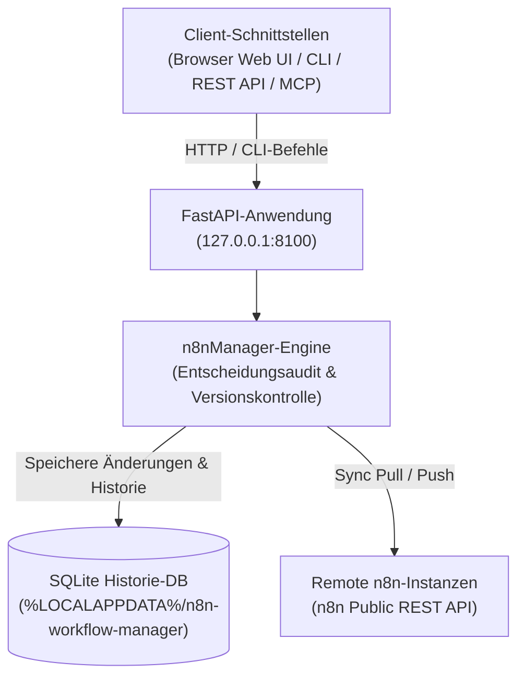
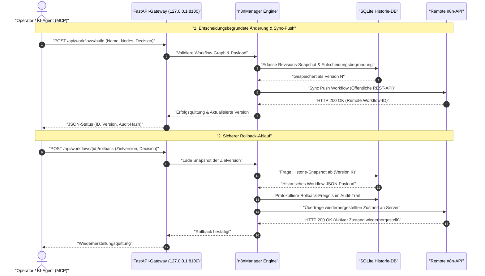

# n8n Workflow Manager

**[English version](README.md)** · **Deutsch**

> Lokale Workflow-Durchsicht, visuelle Prüfung, entscheidungsbegründete Bearbeitung, Historie und Multi-Server-Sync für n8n.

> [!IMPORTANT]
> Unabhängiges Community-Projekt. Weder mit der n8n GmbH verbunden noch von ihr
> unterstützt oder gesponsert. „n8n" ist eine Marke des jeweiligen Inhabers und
> wird hier nur verwendet, um die Software zu bezeichnen, mit der dieses Werkzeug
> zusammenarbeitet.

[](https://www.python.org/downloads/)
[](pyproject.toml)
[](LICENSE)
[](tests)
[](https://fastapi.tiangolo.com/)
[](https://github.com/astral-sh/ruff)
[](#funktionen)
[](SECURITY.md)
[](SECURITY.md)
[](https://github.com/ellmos-ai)
[](https://github.com/open-bricks)
[](llms.txt)

> [!NOTE]
> **KI-Agenten & LLM-Kontext**: Maschinenlesbare Spezifikationen und RAG-Suchphrasen sind in [`llms.txt`](llms.txt) indiziert. Ergänzt sich ideal mit [`n8n-manager-mcp`](https://github.com/ellmos-ai/n8n-manager-mcp) für autonome KI-Workflow-Steuerung mit Entscheidungsverfolgung. Jede ändernde Mutation verlangt zwingend eine explizite Entscheidungsbegründung (`--decision`), um vollständige Auditierbarkeit zu gewährleisten.

## Navigation

- [Systemarchitektur](#systemarchitektur)
- [Workflow-Lebenszyklus](#workflow-lebenszyklus)
- [Governance- & Laufzeit-Invarianten](#governance-und-laufzeit-invarianten)
- [Funktionen](#funktionen)
- [Installation und Start](#installation-und-start)
- [CLI-Beispiele](#cli-beispiele)
- [Builder API](#builder-api)
- [Konfiguration und Daten](#konfiguration-und-daten)
- [Docker](#docker)
- [Entfernte n8n-Installation](#entfernte-n8n-installation)
- [Manager + MCP als Paar](#manager-und-mcp-als-paar)
- [Geschwister-Ökosystem](#geschwister-oekosystem)
- [Prüfung](#pruefung)
- [Lizenz](#lizenz)

---

<a id="systemarchitektur"></a>
## Systemarchitektur



---

<a id="workflow-lebenszyklus"></a>
## Workflow-Lebenszyklus

Das folgende Sequenzdiagramm illustriert, wie Änderungen (wie das Erstellen oder Modifizieren eines Workflows) eine explizite Entscheidungsbegründung erfordern, unveränderliche Snapshots in SQLite speichern, mit Remote-Servern synchronisieren und ein deterministisches Rollback ermöglichen.



---

<a id="governance-und-laufzeit-invarianten"></a>
## Governance- & Laufzeit-Invarianten

| # | Invariante | Beschreibung | Durchsetzungs-Mechanismus |
|---|---|---|---|
| 1 | **100% Local-First & Null Telemetrie** | Vollständige Ausführung auf Loopback `127.0.0.1` ohne externe Tracking- oder Telemetriesignale. | FastAPI Host-Bindung & Test-Suite |
| 2 | **Pflicht-Entscheidungsaudit** | Jede zustandsändernde Operation (`import`, `build`, `push`, `rollback`, `delete`) verlangt eine Begründung (`--decision`). | CLI-Prüfung & REST-Validierung |
| 3 | **SQLite Ereignis- & Snapshot-Ledger** | Vollständige JSON-Snapshots aller Versionen werden dauerhaft und unveränderlich in SQLite geführt. | `n8nManager.core.database`-Schema |
| 4 | **Deterministische Rollback-Garantie** | Jeder frühere Versionsstand kann verlustfrei geprüft und restauriert werden. | `/api/workflows/{id}/rollback` & CLI `rollback` |
| 5 | **Keine Administratorrechte** | Läuft vollständig im Benutzerkontext (RunAsInvoker); unprivilegierter Benutzer im Docker-Container. | User-Space & Docker `USER appuser` |
| 6 | **Plattform-Pfadparität** | Verwendet native Konfigurations- und Datenpfade unter Windows, macOS und Linux. | Platformdirs-Auflösung |
| 7 | **API-Schlüssel-Maskierung** | Sensible Server-Token werden in UI und API maskiert und nur in lokalen Benutzerdaten gehalten. | Serialisierungs-Maskierung |
| 8 | **Lokale Offline-Bibliotheken** | Frontend-Komponenten (vis-network 10.1.0) sind lokal gebündelt für uneingeschränkten Offline-Betrieb. | Statisch eingebettete vis-network Assets |
| 9 | **Agenten- & MCP-Interoperabilität** | Nahtlose Kopplung mit `n8n-manager-mcp` für autonome KI-Steuerung bei voller menschlicher Nachvollziehbarkeit. | REST-Verträge & `llms.txt` |
| 10 | **48-Stunden Sicherheits-SLA** | Koordinierte Schwachstellenbehandlung und schnelle Patches im ellmos-ai- & open-bricks-Verbund. | [SECURITY.md](SECURITY.md)-Richtlinie |

---

<a id="funktionen"></a>
## Funktionen

- Visueller Graph-Viewer und funktionsfähiger Browser-Editor für n8n-Workflow-JSON.
- SQLite-basierte Versionshistorie und Entscheidungsprotokoll für jede Änderung.
- Rollback über REST API oder CLI.
- Eigene Pull/Push-Bindungen je Workflow und Server über die öffentliche n8n API mit Cursor-Paginierung.
- Validierter Import, JSON-/Markdown-Export und generische mitgelieferte Vorlagen.
- FastAPI REST API, Swagger UI und Kommandozeile.

Die Anwendung ist lokal ausgerichtet: Sie bindet standardmäßig an `127.0.0.1`
und speichert Konfiguration sowie Laufzeitdaten in Benutzerverzeichnissen statt
im installierten Paket oder Quellordner.

---

<a id="installation-und-start"></a>
## Installation und Start

```bash
pip install git+https://github.com/ellmos-ai/n8n-workflow-manager.git
n8n-manager serve
```

Öffne <http://127.0.0.1:8100>. Die interaktive API-Dokumentation liegt unter
<http://127.0.0.1:8100/docs>.

Für die Entwicklung:

```bash
git clone https://github.com/ellmos-ai/n8n-workflow-manager.git
cd n8n-workflow-manager
python -m pip install -e ".[dev]"
python -m pytest -q
```

---

<a id="cli-beispiele"></a>
## CLI-Beispiele

> [!WARNING]
> `push`, `rollback` und `delete` verändern oder löschen Workflows **auf dem
> verbundenen n8n-Server**, nicht nur in der lokalen Datenbank. Richte sie nur
> dann auf eine Produktivinstanz, wenn klar ist, welcher Server der Standard ist
> (`n8n-manager status`). Mit `servers --add` hinterlegte API-Schlüssel werden
> **unverschlüsselt** im Benutzerdatenverzeichnis abgelegt; schütze dieses
> Verzeichnis wie einen SSH-Schlüssel. Siehe [SECURITY.md](SECURITY.md).

Änderungen, die Zustand ersetzen oder entfernen, verlangen eine kurze
Begründung. Sie wird in der Workflow-Historie gespeichert.

```bash
n8n-manager import workflow.json --decision "Geprüften Kundenworkflow importieren"
n8n-manager list
n8n-manager history 1
n8n-manager export 1 --format md

n8n-manager servers --add production https://n8n.example.com YOUR_API_KEY --default
n8n-manager push 1 --decision "Geprüfte Version ausrollen"
n8n-manager pull
n8n-manager rollback 1 2 --decision "Letzte stabile Version wiederherstellen"

n8n-manager status                       # effektive Pfade, Datenbank- und Serverstand
n8n-manager config --show                # aufgelöste Konfiguration ansehen
n8n-manager config --set db_path ./my.db # einzelne Einstellung ändern
```

Die TLS-Prüfung ist standardmäßig aktiv. `--no-verify-tls` ist nur für
kontrollierte lokale Umgebungen mit selbstsignierten Zertifikaten gedacht.

---

<a id="builder-api"></a>
## Builder API

```bash
curl -X POST http://127.0.0.1:8100/api/workflows/build \
  -H "Content-Type: application/json" \
  -d '{
    "name": "Webhook-Weiterleitung",
    "decision": "Geprüften Entwurf anlegen",
    "nodes": [
      {"type": "n8n-nodes-base.webhook", "name": "Trigger", "parameters": {"path": "hook"}},
      {"type": "n8n-nodes-base.httpRequest", "name": "Forward", "parameters": {"url": "https://api.example.com"}}
    ],
    "connections": [{"from_node": "Trigger", "to_node": "Forward"}]
  }'
```

Die vollständigen Verträge stehen in der [API-Referenz](docs/API_REFERENCE.md).

---

<a id="konfiguration-und-daten"></a>
## Konfiguration und Daten

`n8n-manager status` zeigt die tatsächlich verwendeten Pfade. Relative
`db_path`-Werte werden im Benutzerdatenverzeichnis aufgelöst.

| Plattform | Konfiguration | Laufzeitdaten |
|---|---|---|
| Windows | `%APPDATA%\n8n-workflow-manager` | `%LOCALAPPDATA%\n8n-workflow-manager` |
| macOS | `~/Library/Application Support/n8n-workflow-manager` | gleiches Verzeichnis |
| Linux | `${XDG_CONFIG_HOME:-~/.config}/n8n-workflow-manager` | `${XDG_DATA_HOME:-~/.local/share}/n8n-workflow-manager` |

Überschreibungen: `N8N_MANAGER_CONFIG`, `N8N_MANAGER_CONFIG_DIR` und
`N8N_MANAGER_DATA_DIR`. Ausgangspunkt ist
[config.example.json](config.example.json).
`trusted_hosts` akzeptiert standardmäßig nur Loopback-Host-Header. Bei einem
authentifizierenden Reverse-Proxy muss dessen geprüfter öffentlicher Hostname
explizit eingetragen werden.

---

<a id="docker"></a>
## Docker

```bash
docker compose up --build -d
```

Compose bindet an `127.0.0.1:8100`; Daten liegen unter `runtime/`. Das Image
läuft als unprivilegierter Benutzer.

---

<a id="entfernte-n8n-installation"></a>
## Entfernte n8n-Installation

Docker muss auf dem Zielsystem bereits entsprechend dessen Betriebssystemregeln
installiert sein. Der Setup-Befehl startet ein fest versioniertes offizielles
n8n-Image nur auf Loopback und führt keinen entfernten `curl | sh`-Installer aus.

```bash
n8n-manager setup --host dein-server --user deploy --ssh-key ~/.ssh/id_ed25519
# Danach den ausgegebenen ssh -L ... Tunnel öffnen und http://127.0.0.1:5678 aufrufen.
```

SSH nutzt Batch-Modus und `StrictHostKeyChecking=accept-new`. Für einen
öffentlichen Dienst ist ein authentifizierender TLS-Reverse-Proxy erforderlich.

---

<a id="manager-und-mcp-als-paar"></a>
## Manager + MCP als Paar

`n8n-workflow-manager` und
[n8n-manager-mcp](https://github.com/ellmos-ai/n8n-manager-mcp) sind als Paar
gedacht: Der MCP-Server bildet die KI-Aktionsschicht; dieses Projekt ist die
Zustands- und Verlaufsschicht für Menschen mit visueller Prüfung,
Entscheidungsprotokoll, Versionen und Rollback. Ein Client kann zuerst
`/api/workflows/{id}/history` lesen und anschließend die erforderliche
Begründung für eine Änderung übermitteln.

Das maßgebliche Entscheidungsprotokoll liegt hier und ist client-unabhängig. Es
kann daher MCP, `curl`, CLI und Web-UI gleichermaßen abdecken. Zusätzlicher
Konversationskontext kann aus einem pull-basierten Verlaufsindex wie
[ctx](https://github.com/ctxrs/ctx) (Apache-2.0) stammen.

Wer n8n nicht einzeln, sondern als Teil eines selbst gehosteten Stacks betreibt:
[ellmos-stack](https://github.com/ellmos-ai/ellmos-stack) startet n8n zusammen mit
Ollama und einer Dokumentensuche über Docker Compose; dieser Manager verbindet
sich anschließend wie mit jedem anderen n8n-Server.

---

<a id="geschwister-oekosystem"></a>
## Geschwister-Ökosystem

`n8n-workflow-manager` ist ein zentraler Baustein der Open-Source-Ökosysteme von [ellmos-ai](https://github.com/ellmos-ai) und [open-bricks](https://github.com/open-bricks):

| Repository | Zweck | Integration |
|---|---|---|
| [`ellmos-ai/n8n-manager-mcp`](https://github.com/ellmos-ai/n8n-manager-mcp) | MCP-Server für n8n-Workflow-Steuerung | Autonome KI-Aktionsschicht mit Entscheidungsprotokoll |
| [`ellmos-ai/ellmos-stack`](https://github.com/ellmos-ai/ellmos-stack) | Lokaler KI- & Automations-Stack | Betreibt n8n, Ollama und Chroma per Docker Compose |
| [`ellmos-ai/ellmos-homebase-mcp`](https://github.com/ellmos-ai/ellmos-homebase-mcp) | Zentrales Wissens- & Gedächtnis-MCP | Sitzungsübergreifendes Gedächtnis und Agentenkoordination |
| [`ellmos-ai/ellmos-controlcenter-mcp`](https://github.com/ellmos-ai/ellmos-controlcenter-mcp) | Multi-Agenten-Registry & Tool-Orchestrierung | Dynamische Werkzeugbündelung und Routing |
| [`open-bricks/open-bricks`](https://github.com/open-bricks) | Dachorganisation für Open-Source-Software | Gemeinsame Standards, Sicherheitsrichtlinien und Governance |

---

<a id="pruefung"></a>
## Prüfung

Der Releasevertrag steht in [RELEASE_GATE.md](RELEASE_GATE.md). Die zentralen
lokalen Gates sind:

```bash
python -m pytest -q
python -m ruff check n8nManager tests
python -m bandit -q -r n8nManager -lll
python -m pip_audit
python -m build
```

---

<a id="lizenz"></a>
## Lizenz

MIT, siehe [LICENSE](LICENSE). Nutzung auf eigenes Risiko; keine Gewähr und
keine Wartungszusage.

Diese Lizenz deckt den für dieses Projekt geschriebenen Code. Repository und
Distributionen enthalten zusätzlich die Browser-Bibliothek **vis-network** (dual
lizenziert Apache-2.0 oder MIT; hier unter der MIT-Option genutzt) mit eigenen
Rechteinhabern. Vollständige Hinweise:
[THIRD_PARTY_LICENSES.md](THIRD_PARTY_LICENSES.md).
